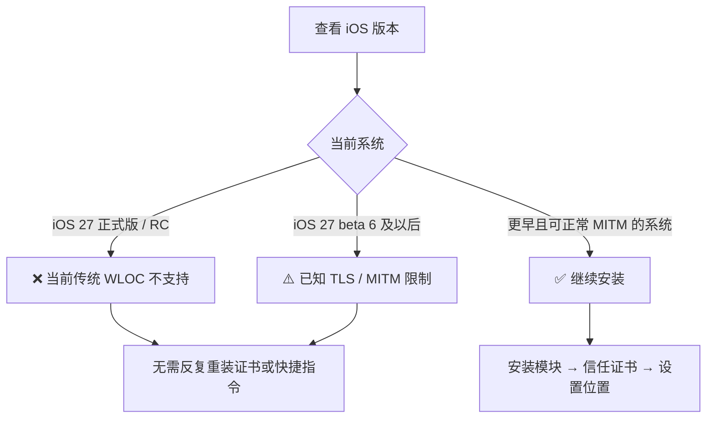
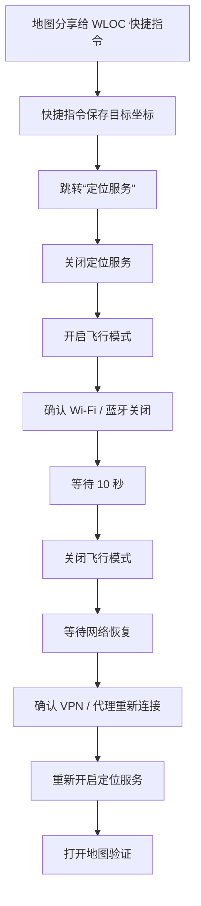

<p align="center"></p>

# WLOC 社区维护版

基于 Yu9191/wloc 恢复的 Apple 网络定位修改工具。通过 Surge、Quantumult X、Loon、Stash 或 Shadowrocket 拦截 Wi-Fi / 基站网络定位响应，配合网页选点、快捷指令和代理客户端本地持久化存储使用。

本分支保留上游作者及贡献者记录，以 `529fcd8`（2026-09-04）为恢复基线。它不是原作者官方仓库，也不能修改 GPS 硬件定位。

> [!IMPORTANT]
> ## ⚠️ iOS 27 正式版当前不支持
>
> **如果你的设备已经升级到 iOS 27 正式版 / RC，请不要继续反复重装模块、证书或快捷指令。**
>
> 上游从 iOS 27 beta 6 起已出现与 WLOC 相关的 TLS / MITM 限制；当前传统 WLOC 依赖代理客户端对 Apple 网络定位请求进行 HTTPS 解密，因此本维护版对 **iOS 27 正式版按不支持处理**。
>
> 在 iOS 27 正式版上出现“快捷指令报错”“网络连接已中断”“网页显示保存成功但地图不变”等现象，通常并不代表安装步骤做错了。
>
> **旧版 iOS / 仍允许该 MITM 链路工作的版本**可以继续参考下面的安装教程。

## 先确认你的系统版本

打开：

```text
设置
→ 通用
→ 关于本机
→ iOS 版本
```

判断：



## 快速使用流程

第一次使用建议严格按这个顺序，不要跳步骤：

```text
安装对应客户端模块
→ 开启 WLOC 模块
→ 开启 MITM / HTTPS 解密
→ 安装 CA 描述文件
→ 在“证书信任设置”中开启完全信任
→ 确认代理 / VPN 正常连接
→ 在地图中选择目标位置
→ 分享到「WLOC设置位置 xepes0」
→ 快捷指令保存坐标并跳转到“定位服务”
→ 关闭定位服务
→ 开启飞行模式
→ 确认 Wi-Fi 和蓝牙同时关闭
→ 等待 10 秒
→ 关闭飞行模式
→ 等待网络和 VPN / 代理恢复
→ 最后重新开启定位服务
→ 打开地图验证
```

---

## WLOC 需要什么？

WLOC 不是安装一个快捷指令就能直接工作。完整链路至少包含：


缺少任何一项，都可能出现“能打开网页但不能保存”“快捷指令请求失败”“保存成功但地图不变”等问题。

## 订阅地址

<!-- subscriptions:start -->
| 客户端 | 订阅地址 |
| --- | --- |
| Surge / Egern | [https://raw.githubusercontent.com/shix1aobao/wloc/refs/heads/main/modules/wloc.sgmodule](https://raw.githubusercontent.com/shix1aobao/wloc/refs/heads/main/modules/wloc.sgmodule) |
| Quantumult X | [https://raw.githubusercontent.com/shix1aobao/wloc/refs/heads/main/modules/wloc.conf](https://raw.githubusercontent.com/shix1aobao/wloc/refs/heads/main/modules/wloc.conf) |
| Loon | [https://raw.githubusercontent.com/shix1aobao/wloc/refs/heads/main/modules/wloc.lpx](https://raw.githubusercontent.com/shix1aobao/wloc/refs/heads/main/modules/wloc.lpx) |
| Stash | [https://raw.githubusercontent.com/shix1aobao/wloc/refs/heads/main/modules/wloc.stoverride](https://raw.githubusercontent.com/shix1aobao/wloc/refs/heads/main/modules/wloc.stoverride) |
| Shadowrocket | [https://raw.githubusercontent.com/shix1aobao/wloc/refs/heads/main/modules/wloc.module](https://raw.githubusercontent.com/shix1aobao/wloc/refs/heads/main/modules/wloc.module) |

选点页面：尚未配置公共实例，请按下方说明自行部署。

[浏览源码](https://github.com/shix1aobao/wloc) · [部署到 Cloudflare Workers](https://deploy.workers.cloudflare.com/?url=https://github.com/shix1aobao/wloc/tree/main/worker)
<!-- subscriptions:end -->

Egern 沿用上游 Surge 模块兼容说明，尚未单独复核。Stash 使用原生 `.stoverride`。

## 一、安装 WLOC 模块

选择自己正在使用的代理客户端，导入上表对应模块。

### Loon

大致路径：

```text
Loon
→ 配置
→ 插件
→ +
→ 添加 URL
→ 粘贴 wloc.lpx 地址
→ 安装
→ 打开插件开关
```

### Shadowrocket

不同版本菜单名称可能略有不同，一般在：

```text
Shadowrocket
→ 配置 / 模块
→ 添加模块
→ URL
→ 粘贴 wloc.module 地址
→ 保存并启用
```

### Surge

```text
Surge
→ 模块
→ 安装新模块
→ 从 URL 安装
→ 粘贴 wloc.sgmodule 地址
→ 启用
```

Quantumult X、Stash、Egern 同理，在模块 / 重写 / Override 等页面导入对应 URL。

> [!WARNING]
> **模块显示“已安装”并不代表 WLOC 已经能工作。**
>
> WLOC 还必须开启 MITM / HTTPS 解密，并安装、完全信任代理客户端生成的 CA 证书。

## 二、开启 MITM 并安装、信任证书

WLOC 需要处理包括以下域名在内的 Apple 网络定位请求：

```text
gs-loc.apple.com
gs-loc-cn.apple.com
gsp-ssl.ls.apple.com
```

因此必须启用代理客户端的 MITM / HTTPS 解密功能。

### 1. 在代理客户端中生成并安装 CA

在客户端中找到类似：

```text
MITM
HTTPS 解密
HTTPS Decryption
证书
Certificate
```

的设置页，生成 CA 证书，然后选择“安装证书 / Install Certificate”。

### 2. 安装 iOS 描述文件

打开：

```text
设置
→ 通用
→ VPN与设备管理
```

找到刚才下载的证书描述文件，点击安装并按系统提示完成。

### 3. 开启“完全信任”

**这是最容易漏掉的一步。**

继续打开：

```text
设置
→ 通用
→ 关于本机
→ 证书信任设置
```

找到刚才由 Loon / Shadowrocket / Surge / Quantumult X 等客户端生成的 CA，打开：

```text
针对根证书启用完全信任
```

> [!IMPORTANT]
> **安装描述文件 ≠ 已经完全信任证书。**
>
> 没有完成“证书信任设置”时，常见现象包括：
>
> - 快捷指令提示网络连接已中断；
> - 请求失败；
> - Safari 或定位请求出现证书错误；
> - 设置坐标后没有效果。

完成后返回代理客户端，确认 **WLOC 模块、MITM、代理 / VPN** 都处于启用状态。

## 三、安装快捷指令

| 快捷指令 | 安装入口 | 用途 |
| --- | --- | --- |
| WLOC设置位置 xepes0 | [https://www.icloud.com/shortcuts/0a6465168d554135b78008a8b4bd7c01](https://www.icloud.com/shortcuts/0a6465168d554135b78008a8b4bd7c01) | 从地图分享位置，解析坐标并保存到代理客户端 |
| wloc 清理恢复位置 | [https://www.icloud.com/shortcuts/f42632d406504f24a2cd163af4fe012f](https://www.icloud.com/shortcuts/f42632d406504f24a2cd163af4fe012f) | 清除已保存的虚拟坐标 |

“WLOC设置位置 xepes0”基于原作者版本，当前解析服务为：

```text
https://wloc.xepesw.workers.dev/api/parse
```

维护者已对当前快捷指令的 `/api/parse?format=json` 解析链路进行过真机测试。**这只表示快捷指令解析链路可工作，不代表 iOS 27 正式版支持传统 WLOC。**

已安装的旧快捷指令不会自动更新；如果一直使用旧版本，可能出现“获取词典值失败”等错误。更多迁移说明见 [快捷指令迁移说明](docs/shortcut-guide.md#快捷指令)。

## 四、方法 A：直接使用网页选点

打开：

**https://wloc.xepesw.workers.dev/**

可以在地图上选点、搜索地点、输入经纬度或粘贴地图分享链接。

选择位置后点击：

**储存到设备**


> [!IMPORTANT]
> 使用网页保存时，Safari 必须经过当前启用 WLOC 的代理客户端。网页显示成功只代表保存链路完成，不等于系统定位一定已经改变。

## 五、方法 B：Apple 地图分享到快捷指令

### 1. 在 Apple 地图中选位置

打开 Apple 地图，搜索目标地点，或者在目标位置 **长按地图** 创建标记。

### 2. 打开地点卡片并点击“共享”

点击 / 上滑底部地点卡片，找到：

```text
共享
```

### 3. 在系统分享菜单中选择

```text
WLOC设置位置 xepes0
```

流程：


### 分享菜单里没有 WLOC？

先打开“快捷指令”App，手动运行一次“WLOC设置位置 xepes0”，完成系统要求的权限询问。

然后重新：

```text
Apple 地图
→ 选择地点
→ 共享
→ 更多
```

检查“WLOC设置位置 xepes0”是否出现在系统分享菜单中。

## 六、高德地图分享到快捷指令

高德地图通常需要先进入系统分享菜单：

```text
高德地图
→ 搜索 / 选择地点
→ 分享
→ 更多
→ iOS 系统分享菜单
→ WLOC设置位置 xepes0
```

不要只复制地点名称。快捷指令需要地图分享产生的 URL / 文本，再交给解析接口转换成经纬度。

## 七、快捷指令保存坐标后：必须按顺序刷新定位

“WLOC设置位置 xepes0”保存坐标后，会跳转到：

```text
设置
→ 隐私与安全性
→ 定位服务
```

接下来按以下顺序操作。

### 1. 关闭定位服务

在“定位服务”页面关闭总开关。

### 2. 打开飞行模式

打开飞行模式以后，**确认 Wi-Fi 和蓝牙也已经关闭**。

> [!IMPORTANT]
> iOS 可能保留用户之前手动开启的 Wi-Fi / 蓝牙状态，所以不要只看飞行模式图标。请实际确认：
>
> - 飞行模式：开启
> - Wi-Fi：关闭
> - 蓝牙：关闭
> - 定位服务：关闭

### 3. 等待 10 秒

保持上面的状态约 **10 秒**。

### 4. 关闭飞行模式

10 秒后关闭飞行模式。

### 5. 等待网络和 VPN / 代理恢复

不要马上开启定位服务。先确认：

- Wi-Fi 或蜂窝数据已经重新联网；
- Loon / Surge / Shadowrocket / Quantumult X 等代理客户端已恢复；
- VPN 状态已经重新连接；
- WLOC 模块仍处于启用状态。

### 6. 最后重新开启定位服务

确认网络和 VPN / 代理恢复以后，再回到：

```text
设置
→ 隐私与安全性
→ 定位服务
```

重新打开定位服务。

完整顺序：



> [!WARNING]
> 推荐顺序是：
>
> **关闭定位 → 开飞行模式 → 确认 Wi-Fi / 蓝牙关闭 → 等 10 秒 → 关飞行模式 → 等网络和 VPN 恢复 → 最后重新开启定位。**
>
> 如果在 VPN / 代理尚未恢复时就先开启定位服务，系统可能先获得未经过 WLOC 环境的定位结果。
>
> 这套刷新流程也无法绕过 iOS 27 正式版的 TLS / MITM 限制。

## 八、验证是否生效

完成上面的刷新流程后：

1. 确认 VPN / 代理已经连接；
2. 确认 WLOC 模块仍然启用；
3. 确认定位服务已经重新开启；
4. 完全退出 Apple 地图；
5. 重新打开地图；
6. 等待几秒观察蓝点位置。

> [!NOTE]
> WLOC 修改的是 Apple 的 **Wi-Fi / 基站网络定位结果**，不是直接修改 GPS 芯片。
>
> 如果设备能够获得真实 GPS 信号，系统仍可能使用 GPS 覆盖网络定位。因此可能出现：
>
> **先跳到虚拟位置，过几秒或几十秒后又回到真实位置。**
>
> 建议首次测试尽量在室内或 GPS 信号较弱的环境进行。

## 九、恢复真实位置

运行：

**wloc 清理恢复位置**

也可以通过网页清除已经保存的坐标。

清除后建议：

1. 完全退出地图 App；
2. 等待系统重新获取定位；
3. 必要时重启设备。

如果清除后仍然处于虚拟位置，请检查模块参数中是否另外填写了固定的：

```text
longitude
latitude
```

如果模块本身配置了固定经纬度，仅清除网页 / 快捷指令保存的数据仍可能继续使用模块参数。此时关闭 WLOC 模块或恢复默认参数后再测试。

## 十、常见错误

### iOS 27 正式版：快捷指令报错 / 无法生效

当前传统 WLOC 不支持 iOS 27 正式版。不要把主要精力放在重复安装证书、模块和快捷指令上。

### “网络连接已中断”

如果不是 iOS 27 正式版，请依次检查：

1. WLOC 模块是否启用；
2. 代理 / VPN 是否正在运行；
3. MITM / HTTPS 解密是否启用；
4. CA 描述文件是否安装；
5. CA 是否在“证书信任设置”中开启完全信任；
6. 快捷指令和 Safari 请求是否经过当前代理客户端。

### “获取词典值失败”

通常表示快捷指令原本期望获得 JSON，但实际拿到了普通文本、旧接口结果或错误页面。

当前解析接口使用：

```text
https://wloc.xepesw.workers.dev/api/parse?format=json&u=...
```

如果仍在使用旧快捷指令，请改用 README 当前提供的版本。

不要把：

```text
https://gs-loc.apple.com/wloc-settings/save
```

替换成 Worker 地址；这个 Apple 地址就是由本机 WLOC 模块拦截的保存路径。

### 快捷指令分享链接提示“无法找到捷径”

先重新打开 README 当前提供的 iCloud 快捷指令链接。如果 iCloud 分享服务暂时异常，也可以直接使用网页选点：

**https://wloc.xepesw.workers.dev/**

### 网页显示保存成功，但地图位置不变

常见原因：

- 当前 iOS 版本已不支持这条 MITM 链路；
- MITM 或 CA 完整信任未配置正确；
- Safari 没有经过当前代理客户端；
- GPS 正在提供真实位置；
- Apple 定位缓存尚未刷新；
- WLOC 模块没有实际拦截到定位响应；
- 同时启用了多个旧 / 新 WLOC 模块。

### 虚拟位置过一会又恢复真实位置

这通常需要判断是否被真实 GPS 覆盖。WLOC 不是 GPS 硬件模拟，室外或 GPS 信号较强时更容易发生。

## 十一、提交 Issue 前请提供这些信息

为了避免只能收到“不能用”“失效了”但无法判断原因的反馈，提交 Issue 时请尽量填写：

```text
iPhone 型号：
iOS 完整版本：
代理客户端：
代理客户端版本：
WLOC 模块是否启用：
MITM 是否开启：
CA 是否已在“证书信任设置”开启完全信任：
使用网页还是快捷指令：
使用 Apple 地图 / 高德地图 / 百度地图：
具体错误提示：
```

如果是地图分享 / 解析问题，再提供：

```text
分享出来的原始地图链接：
```

如果方便，可附错误截图、快捷指令报错位置和相关代理日志。**请先删除节点密码、Token、证书私钥以及其他敏感信息。**

## 十二、快速排障表

| 现象 | 最先检查 |
| --- | --- |
| iOS 27 正式版无法使用 | 当前传统 WLOC 不支持 |
| 快捷指令“网络连接已中断” | iOS 版本、MITM、CA 完全信任、VPN |
| “获取词典值失败” | 是否使用最新快捷指令、解析接口是否返回 JSON |
| 分享菜单没有 WLOC | 快捷指令是否安装、是否出现在系统分享菜单 |
| 模块下载失败 | GitHub Raw 是否能访问 |
| 网页打不开 | Worker / CDN / 当前网络 |
| 网页能打开但无法储存 | Safari 是否经过代理、模块和 MITM |
| 储存成功但地图不变 | iOS 版本、GPS、缓存、模块是否命中 |
| 几秒或几十秒后跳回真实位置 | GPS 覆盖网络定位 |
| 清除后仍是虚拟位置 | 模块参数、固定经纬度、重复模块 |

只在自己拥有或获授权的设备上进行定位测试。更多快捷指令迁移和故障分层见 [使用、迁移与排障](docs/shortcut-guide.md)。

## 部署

推荐自行部署 Worker。进入本仓库的 `worker` 目录运行：

```sh
npm ci
npm run build:check
npx wrangler login
npm run deploy
```

本项目使用 Node.js 22 或更新版本；Wrangler 已固定到锁文件。部署不需要 KV 或数据库。Cloudflare Pages 配置也保留，见[部署说明](docs/DEPLOYMENT.md)。

原作者的公共 Worker 和 Pages 不再作为默认选点服务；上方设置位置快捷指令已使用本仓库的新解析服务，自行部署时可按实际地址迁移。新维护者在 `project.config.json` 中填写仓库、发布分支及可选的选点站点，再运行：

```sh
npm run configure
npm run check:release
```

该命令会统一更新五种模块的脚本、图标和主页地址，以及本页订阅地址和网页源码入口。

## 工作原理与数据

```text
选点网页 → gs-loc.apple.com/wloc-settings/save
         → 客户端模块拦截并写入 wloc_settings
WLOC 响应 → dist/wloc.js 读取配置并修改返回坐标
```

- `worker/src/`：网页、地图链接解析、GCJ-02/BD-09/WGS84 转换与 HTTP 路由。
- `dist/`：上游已打包的两个代理脚本；**当前恢复版本缺少完整的原始脚本构建工程**，不能声称已实现可复现重建。
- `modules/`：五种客户端订阅文件，由 `templates/modules/` 和项目配置生成。
- `worker/test/`：解析、Stash 输出及 HTTP 行为的自动测试。

生效坐标保存在代理客户端的 `wloc_settings`；收藏保存在浏览器 `localStorage`，两者独立。Worker 的解析接口不主动写数据库或应用日志，并返回 `Cache-Control: no-store`。但地图、搜索、CDN 和托管平台会接收相应网络请求，不能将其理解为整个链路不产生记录。详见[安全与隐私说明](SECURITY.md)。

页面内部使用 WGS84。中国大陆的苹果地图/高德、百度链接按上游逻辑进行坐标转换；港澳台及境外存在不同规则，已用回归用例覆盖部分边界。外部地图链接格式变化仍可能影响解析。

## 参数

| 参数 | 含义 | 上游默认行为 |
| --- | --- | --- |
| longitude / latitude | 目标经纬度 | 未自定义时透传；默认占位坐标为 113.94114 / 22.544577 |
| accuracy | 精度，米 | 25 |
| randomRadius | 随机扰动半径，米 | 0，关闭 |
| logLevel | 日志级别 | info |

优先级：页面保存的坐标 > 模块参数 > 默认值。QX 可在网页设置扰动半径，其余客户端也可修改模块参数。保留上游协议路径、域名匹配和持久化键，便于旧用户迁移。

## 开发与维护

```sh
npm --prefix worker ci
npm run check
npm test
npm run build:check
npm run pages:build
```

`npm test` 同时执行 `.test.mjs` 和 `.test.js`，包括上游曾被默认命令漏掉的 Stash 测试。构建检查仅产出本地文件，不会部署。

提交方式见 [CONTRIBUTING.md](CONTRIBUTING.md)；恢复来源和缺失内容见[来源记录](docs/PROVENANCE.md)；待处理问题、发布步骤及真机验证清单见[维护说明](docs/MAINTENANCE.md)。

## 致谢

- [proxypin-wloc-spoofer](https://github.com/FFF686868/proxypin-wloc-spoofer) - 原始 WLOC 定位修改思路 by FFF686868
- [NSNanoCat/Util](https://github.com/NSNanoCat/util) - 跨平台脚本工具框架

### 贡献者

- [@YmlyZA](https://github.com/YmlyZA) - 百度地图支持、港澳台边界处理、GCJ 换算优化、回归测试覆盖 ([#83](https://github.com/Yu9191/wloc/pull/83))
- [@YeTianXingShi](https://github.com/YeTianXingShi) - randomRadius 随机坐标扰动功能原始实现 ([#70](https://github.com/Yu9191/wloc/pull/70))
- [@SajoLuo](https://github.com/SajoLuo) - Stash 响应格式修复 ([#66](https://github.com/Yu9191/wloc/pull/66))
- [@SkywardLab](https://github.com/SkywardLab) - 扩展 WLOC 备用域名拦截 ([#90](https://github.com/Yu9191/wloc/pull/90))
- [@beiming0000](https://github.com/beiming0000) - 逗号小数格式坐标丢失问题报告 ([#96](https://github.com/Yu9191/wloc/issues/96))

## 许可证

保留上游 [AGPL-3.0 许可证](LICENSE)、作者署名及贡献记录。原 README 还包含关于商业产品和应用商店的额外声明，原文及其与标准许可证的区别见 [NOTICE.md](NOTICE.md)。本次整理未改写 LICENSE，也未完成第三方打包组件的完整许可证审计。

## 免责声明

本项目仅用于授权测试、安全研究和 QA 场景复现。

使用本项目即表示你理解并同意：

- 只能测试你自己拥有，或已获得明确授权的设备、应用、账号和网络。
- 你需要自行遵守所在地法律法规、平台规则和服务条款。
- 作者不对任何滥用行为、服务违规、账号封禁、数据损失、法律后果或其他损害负责。
- 本项目按“原样”提供，不提供任何形式的担保。

不要使用本项目欺骗服务、绕过规则、伪造生产环境定位数据，或在未经授权的设备和网络上使用。

